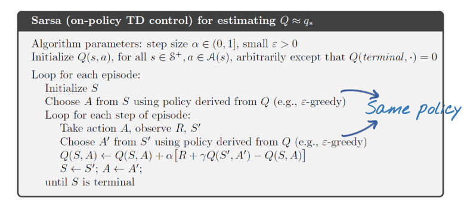
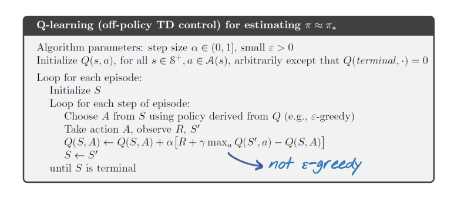
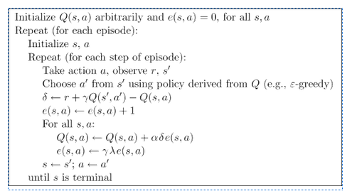
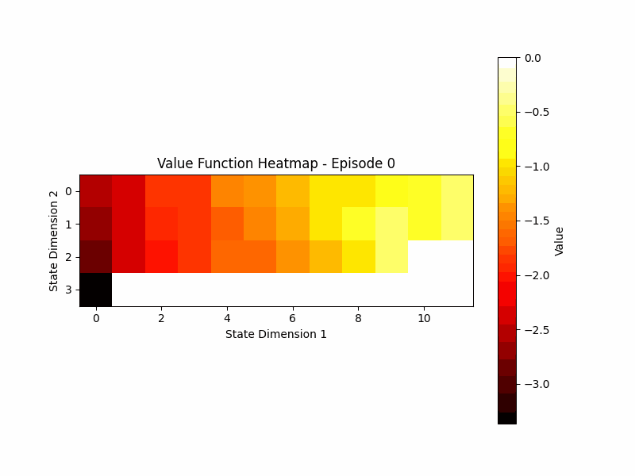
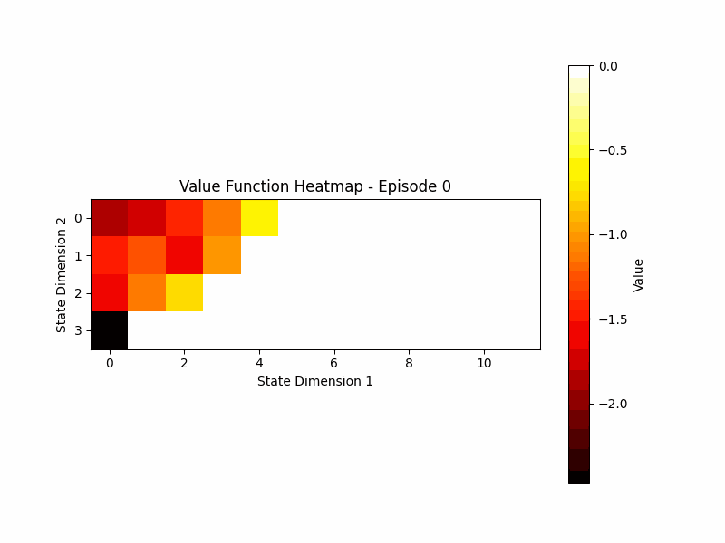
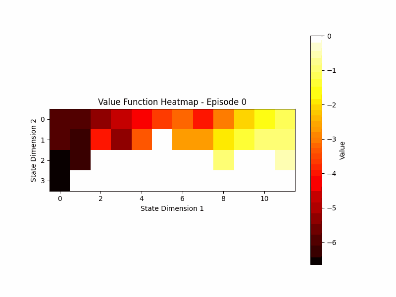
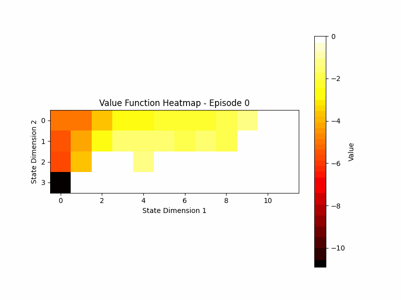

# Model-Free Learning

This repository contains implementations of various model-free reinforcement learning algorithms, including SARSA, Q-Learning, and SARSA with eligibility traces (SARSA-Lambda). These algorithms are used to solve sequential decision-making problems without requiring a model of the environment.

## TODO

- [ ] Clean Up Scripts
- [ ] Add Argparser
- [ ] Implement Monte-Carlo via TD(n-step)

## Table of Contents

- [Algorithms](#algorithms)
  - [SARSA (State-Action-Reward-State-Action)](#sarsa-state-action-reward-state-action)
  - [Q-Learning](#q-learning)
  - [SARSA-Lambda (SARSA with Eligibility Traces)](#sarsa-lambda-sarsa-with-eligibility-traces)
- [Installation](#installation)
- [Usage](#usage)
- [Results](#results)
- [Contributions](#contributions)

## Algorithms

### SARSA (State-Action-Reward-State-Action)

SARSA is an on-policy temporal difference (TD) control algorithm that learns an action-value function Q(s, a) directly from experience. It updates the Q-value estimates based on the transition from the current state-action pair to the next state-action pair and the reward received.



### Q-Learning

Q-Learning is an off-policy TD control algorithm that learns an action-value function Q(s, a) directly from experience. It updates the Q-value estimates based on the maximum expected future reward from the next state, rather than the actual action taken.



### SARSA-Lambda (SARSA with Eligibility Traces)

SARSA-Lambda is an extension of the SARSA algorithm that incorporates eligibility traces. Eligibility traces allow the algorithm to update the value function for previously visited state-action pairs, enabling faster learning and better performance in certain environments.



## Installation

To install the required dependencies, run:

```bash
git clone https://github.com/nicholasbaard/Model-Free-Learning.git
pip install -r requirements.txt
```

## Usage

Each algorithm is implemented in a separate Python file. You can run the algorithms on different environments by modifying the code accordingly.

```bash
cd src
python sarsa.py
python q_learning.py
python sarsa_lambda.py
```

## Results

Here are the results of running SARSA-Lambda for 500 episodes on the `CliffWalking-v0` environment for 5 different values of lambda.

### Lambda = 0.0



### Lambda = 0.3



### Lambda = 0.5



### Lambda = 0.7



### Lambda = 0.9


## Contributions

Contributions to this repository are welcome! If you find any issues or have suggestions for improvements, please open an issue or submit a pull request.
